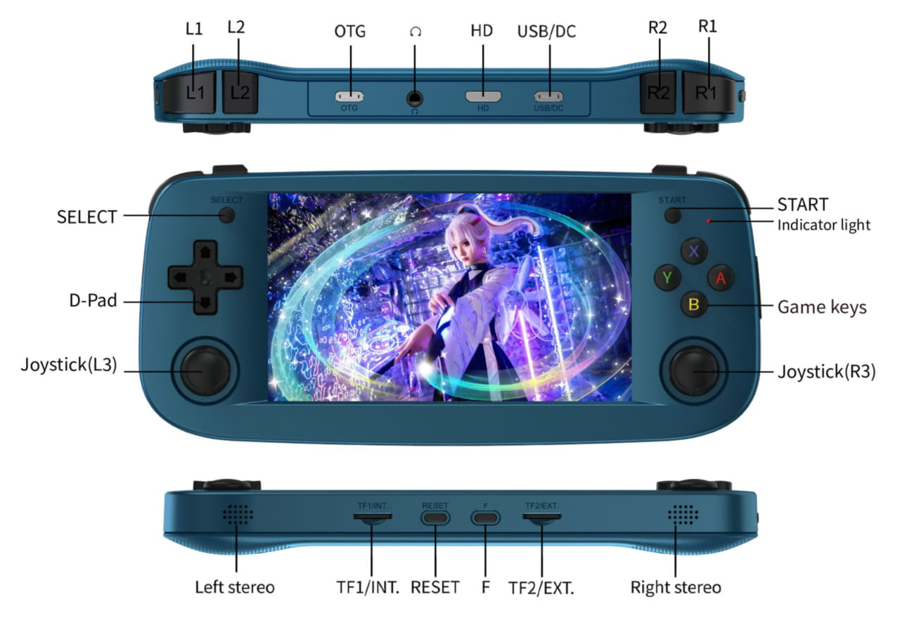

## RG503


Global Hotkey: F Button

F and Dpad Up = Brightness Up  
F and Dpad Down = Brightness Down  
F and Dpad Left = Dark on  
F and Dpad Right = Dark off  
F and Volume Up = Brightness Up (Can be held for continuous brightness increase)  
F and Volume Down = Brightness Down (Can be held for continuous brightness decrease)  

F and X = Volume Up  
F and B = Volume Down  
F and Y = Mute  
F and A = Volume 75%  

F and L1 = Toggle Bluetooth  
F and L2 = Toggle Speaker (Speaker/Headphone)  

F and R1 = Wifi On  
F and R2 = Wifi Off  

F and Power = Safely shutdown device  
Power (Short Press) = Put device to sleep  

-----


Prequisites
===========
You need at least Rust version 1.5.1. If you use Christians pre built virtual machine image with a chroot for arm64 https://forum.odroid.com/viewtopic.php?p=306185#p306185 use

```
apt install brightnessctl autotools-dev automake libtool libtool-bin libevdev-dev
```

and download and install

```
https://static.rust-lang.org/rustup/dist/aarch64-unknown-linux-gnu/rustup-init
```

Select platform "aarch64-unknown-linux-gnu", version "stable" and "minimal".


To compile from device:

```
sudo apt install brightnessctl rustc autotools-dev automake libtool libtool-bin libevdev-dev
```

Build
=====
```
git clone https://github.com/JuanMiguelBG/ogage.git -b rg503
cd ogage
cargo build --release
strip target/release/ogage
```

ogage executable will be in the target/release folder.
